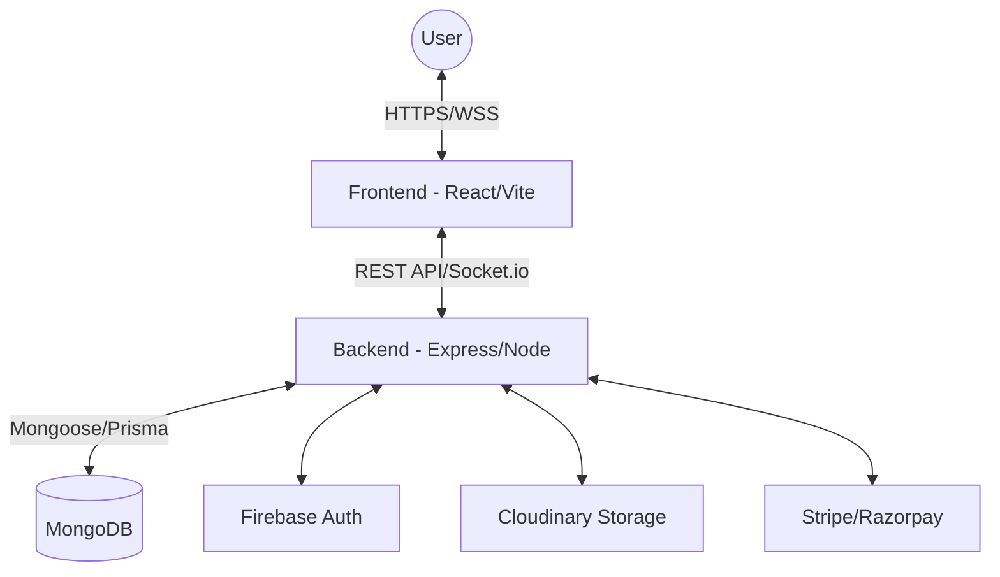

# 🎓 University Academy Management Platform

A modern, comprehensive, and scalable management platform for educational institutions. This platform streamlines administrative tasks, academic management, and student services into a unified ecosystem.


---

## 🌟 Overview

University Academy is a full-stack solution designed to bridge the gap between students, faculty, and administrators. It provides real-time communication, robust academic tracking, and secure financial management, all within a responsive and intuitive interface.

## 🏗️ Architecture

The project follows a decoupled **Client-Server Architecture** with a clear separation of concerns:

- **Frontend**: A high-performance SPA built with React 19, Vite, and Tailwind CSS.
- **Backend**: A modular, domain-driven API built with Express.js, TypeScript, and MongoDB.



---

## 🚀 Key Features

### 🏛️ For Administrators
- **Admission Management**: Handle applications and enrollment workflows.
- **Financial Control**: Manage fee structures, payments, and reporting.
- **System Configuration**: Fine-tune site settings and roles.

### 👨‍🏫 For Faculty
- **Academic Management**: Organize courses, sessions, and attendance.
- **Assignment System**: Create, distribute, and grade assignments effortlessly.
- **Dashboard**: Real-time insights into student performance and scheduled tasks.

### 🎓 For Students
- **Campus Life**: Join clubs, participate in athletics, and stay updated on events.
- **Learning Hub**: Access course materials, submit assignments, and track grades.
- **Communication**: Integrated chat and real-time notifications.

---

## 🛠️ Tech Stack

### Frontend
- **Framework**: React 19 (TypeScript)
- **State**: Redux Toolkit
- **Styling**: Tailwind CSS 4.x
- **Build**: Vite 6.x
- **Communication**: Axios & Socket.io-client

### Backend
- **Framework**: Express.js (TypeScript)
- **Database**: MongoDB (Mongoose) + Prisma ORM
- **Authentication**: Firebase Admin & JWT
- **Real-time**: Socket.io
- **Storage**: Cloudinary

---

## 🚦 Getting Started

### Prerequisites
- [Node.js](https://nodejs.org/) (v18+)
- [Docker](https://www.docker.com/) (Optional, for database)
- [MongoDB](https://www.mongodb.com/)

### Installation

1. **Clone the Repository**
   ```bash
   git clone https://github.com/Zallu4435/vago_university.git
   cd university-management-platform
   ```

2. **Backend Setup**
   ```bash
   cd backend
   npm install
   # Configure .env based on .env.example
   npm run dev
   ```

3. **Frontend Setup**
   ```bash
   cd frontend
   npm install
   # Configure .env based on .env.example
   npm run dev
   ```

---

## 📖 Sub-Project Documentation

For detailed technical guides, please refer to:
- [Backend Documentation](backend/README.md)
- [Frontend Documentation](frontend/README.md)

---

## 🔒 Security

- **Authentication**: Secure multi-factor authentication via Firebase.
- **Authorization**: Granular Role-Based Access Control (RBAC).
- **Data Protection**: Encrypted communication and secure storage integrations.

## 🤝 Contributing

Contributions are welcome! Please read our [Contributing Guidelines](CONTRIBUTING.md) and [Code of Conduct](CODE_OF_CONDUCT.md).

## 📄 License

This project is licensed under the MIT License - see the [LICENSE](LICENSE) file for details.

---

*Built with ❤️ by [Muhammed Nazal](https://github.com/Zallu4435)*
