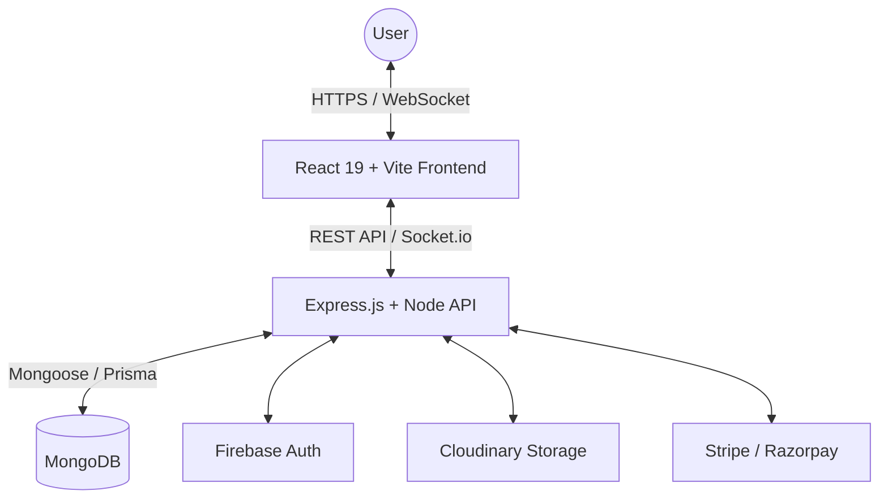

# 🎓 University Academy Management Platform

<div align="center">
  <h3>A Unified Digital Campus Experience</h3>
  <p>A full-stack, scalable university management system designed to streamline academic operations, administration, and student services into a unified digital platform.</p>
</div>

<div align="center">

  [](https://react.dev/)
  [](https://nodejs.org/)
  [](https://www.typescriptlang.org/)
  [](https://www.mongodb.com/)

</div>

---

## 📌 Overview

It enables real-time communication, academic tracking, role-based access control, and secure financial and institutional management.

### 📚 Workspace Documentation
For detailed information on specific parts of the system, please refer to their respective documentation:
- 🖥️ **[Frontend Documentation](./frontend/README.md)**
- ⚙️ **[Backend Documentation](./backend/README.md)**

---

## 🚀 Key Features

### 🏛️ Administration
- Admission and enrollment management
- Fee structure and payment tracking
- Role-based system configuration (RBAC)
- Institutional reporting dashboard

### 👨‍🏫 Faculty
- Course and class management
- Attendance tracking system
- Assignment creation and grading
- Performance analytics dashboard

### 🎓 Students
- Course access and academic materials
- Assignment submission system
- Grades and performance tracking
- Real-time notifications and updates
- Campus events and club participation

---

## 🛠️ Tech Stack

| Layer | Technology |
|------|------------|
| Frontend | React 19, Vite, Tailwind CSS, Redux Toolkit |
| Backend | Node.js, Express.js (TypeScript) |
| Database | MongoDB (Mongoose), Prisma ORM |
| Auth | Firebase Admin, JWT |
| Real-Time | Socket.io |
| Storage | Cloudinary |
| Communication | REST API + WebSockets |

---

## 🏗️ System Architecture



---

## ⚙️ Core Capabilities

- **Real-time notifications** using Socket.io
- **Role-based access control** (Admin / Faculty / Student)
- **Secure authentication** via Firebase + JWT
- **Modular and scalable** backend architecture
- **Cloud-based media storage** integration
- **Structured academic workflow** system

---

## 🚦 Getting Started

### 📦 Prerequisites
- Node.js v18+
- MongoDB instance (local or cloud)
- Firebase project setup
- Cloudinary account

### 1️⃣ Clone Repository
```bash
git clone https://github.com/Zallu4435/vago_university.git
cd university-management-platform
```

### 2️⃣ Backend Setup
```bash
cd backend
npm install
```

Create `.env` file based on `.env.example`, then:
```bash
npm run dev
```

### 3️⃣ Frontend Setup
```bash
cd frontend
npm install
npm run dev
```

---

## 🔐 Security
- Firebase-based authentication
- JWT token-based session handling
- Role-based authorization (RBAC)
- Secure API access control
- Encrypted communication channels

---

## 📂 Project Structure

```text
university-management-platform/
│
├── frontend/
│   ├── src/
│   │   ├── components/
│   │   ├── pages/
│   │   ├── hooks/
│   │   ├── store/
│   │   └── utils/
│   └── public/
│
├── backend/
│   ├── src/
│   │   ├── controllers/
│   │   ├── services/
│   │   ├── routes/
│   │   ├── models/
│   │   ├── socket/
│   │   ├── middleware/
│   │   └── config/
│
└── README.md
```

---

## ⚡ Engineering Highlights
- Modular domain-driven backend architecture
- Real-time event-driven communication system
- Scalable RBAC permission system
- Optimized database schema design
- Socket.io-based live updates system
- Clean separation of frontend/backend concerns

---

## 🌍 Deployment

### Backend
- Render / Railway / AWS
- `npm run build && npm run start`

### Frontend
- Vercel / Netlify
- Add environment variables in dashboard

---

## 🧪 Future Improvements
- Mobile app (React Native)
- AI-based student performance prediction
- Advanced analytics dashboard
- Microservices migration
- Email/SMS notification system
- Multi-campus support

---

## 📄 License
MIT License

## 👨‍💻 Author
Built with ❤️ by Muhammed Nazal