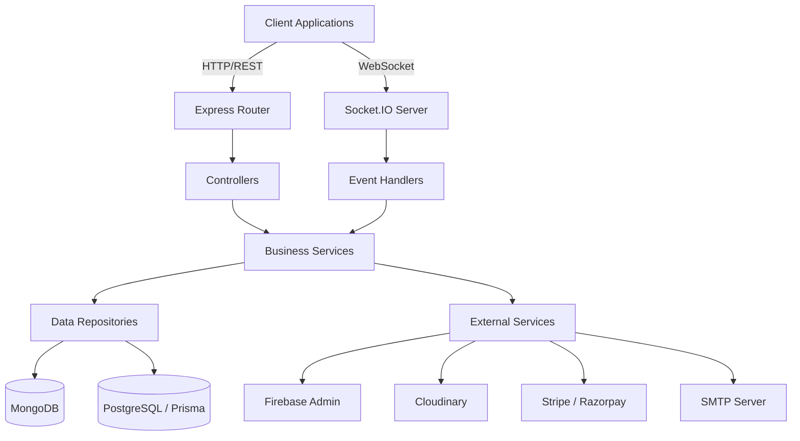

# ⚙️ University Academy Platform (Backend)

<div align="center">
  <h3>Scalable API & Microservices Architecture</h3>
  <p>A comprehensive backend API for managing university academy operations including academics, admissions, faculty management, student services, and real-time communication.</p>
</div>

<div align="center">

  [](https://nodejs.org/)
  [](https://expressjs.com/)
  [](https://www.typescriptlang.org/)
  [](https://www.mongodb.com/)
  [](https://socket.io/)

</div>

---

## 📌 Overview

The **University Academy Backend** provides a highly scalable and secure RESTful API and WebSocket server. It serves as the core data layer for the University Academy Platform, handling everything from role-based authentication to real-time chat, automated email notifications, and payment processing.

---

## 🚀 Key Features

### 🔐 Authentication & Authorization
- JWT token-based authentication
- Firebase Admin integration
- Strict Role-Based Access Control (RBAC)

### 📡 Real-Time Engine
- WebSocket support via Socket.io
- Live notifications & instant messaging
- Real-time academic updates

### 📁 File Management & Storage
- Secure file uploads with Multer
- Cloudinary integration for media storage
- Asset delivery optimization

### 💳 Financial Processing
- Multiple payment gateway integrations (Stripe, Razorpay)
- Automated fee tracking & receipt generation

### 📧 Communications
- Automated email system (Nodemailer)
- Event-driven notifications

---

## 🧠 System Architecture



### 🏗️ Project Structure
```text
src/
├── application/     # Application layer (Use cases, Repositories)
├── domain/          # Domain entities, DTOs, and Business logic
├── infrastructure/  # Database configs, External services
├── presentation/    # HTTP controllers, Routes, Middleware
├── shared/          # Common utilities, Constants, Error handlers
└── app.ts           # Main application entry point
```

---

## 🛠️ Tech Stack

| Component | Technology | Purpose |
| :--- | :--- | :--- |
| **Runtime** | Node.js (v18+) | Server environment |
| **Framework** | Express.js 5.x | Web framework |
| **Language** | TypeScript | Type-safe development |
| **Database** | MongoDB + Prisma | Data persistence |
| **Authentication**| JWT + Firebase Admin | Secure access |
| **Real-time** | Socket.io | WebSocket communication |
| **File Upload** | Multer + Cloudinary | Media management |
| **Payments** | Stripe + Razorpay | Payment processing |
| **Email** | Nodemailer | Email delivery |
| **Logging** | Winston | App monitoring |

---

## ⚙️ Setup & Installation

### 1️⃣ Prerequisites
- Node.js (v18 or higher)
- MongoDB instance (local or Atlas)
- Cloudinary, Firebase, and Stripe/Razorpay accounts

### 2️⃣ Clone and Install
```bash
cd backend
npm install
```

### 3️⃣ Environment Configuration
Create a `.env` file in the backend root directory (copy from `.env.example`):
```env
# Server
PORT=5000
FRONTEND_URL="http://localhost:5173"
CORS_ORIGINS="http://localhost:5173,http://localhost:3000"

# Database
MONGODB_URI="your_mongodb_connection_string"
DATABASE_URL="your_postgresql_connection_string"

# Security
JWT_SECRET="your_jwt_secret_key"
JWT_REFRESH_SECRET="your_refresh_jwt_secret_key"
JWT_EXPIRES_IN="7d"

# Third-Party Services
EMAIL_HOST="your_smtp_host"
CLOUDINARY_CLOUD_NAME="your_cloud_name"
FIREBASE_PROJECT_ID="your_project_id"
STRIPE_SECRET_KEY="your_stripe_secret"
```

### 4️⃣ Run Project
```bash
# Start development server with hot-reload
npm run dev
```

---

## 🌐 API Overview

The backend provides RESTful APIs grouped under `/api/v1/*`:
- `/auth` - User authentication, token refresh
- `/users` - Profile management, RBAC
- `/courses` - Academic courses, assignments, grades
- `/admissions` - Admission workflows
- `/finance` - Fee payments, transaction history
- `/communications` - Notifications, chats

---

## 🔒 Security Practices

- **Input Validation**: Request payload sanitization
- **CORS Configuration**: Restricting origins securely
- **Rate Limiting**: Preventing DDoS and brute-force attacks
- **Secure Uploads**: Verifying file signatures before Cloudinary push

---

## 📜 License
This project is licensed under the MIT License.
