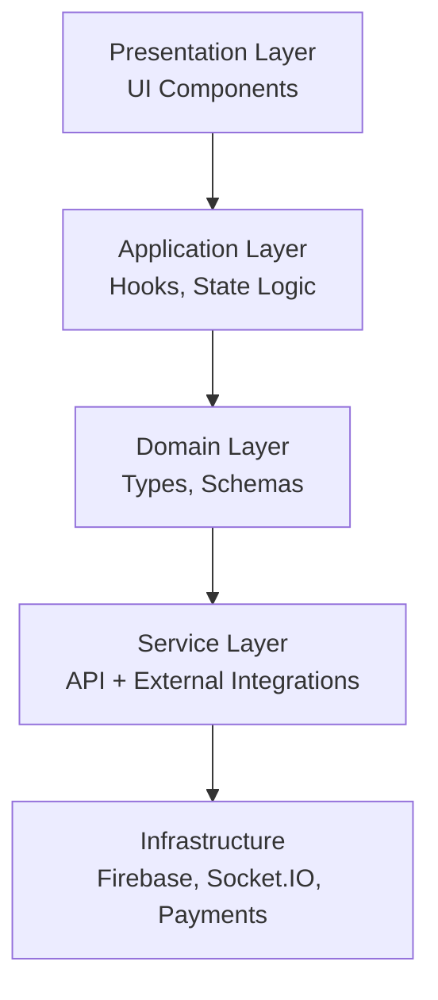

# 🎓 University Academy Platform (Frontend)

<div align="center">
  <h3>Modern University Management Frontend System</h3>
  <p>A production-grade, role-based university management interface built with React 19, TypeScript, and Vite — designed for students, faculty, and administrators with real-time communication, payments, analytics, and PWA support.</p>
</div>

<div align="center">

  [](https://react.dev/)
  [](https://www.typescriptlang.org/)
  [](https://vitejs.dev/)
  [](https://tailwindcss.com/)
  [](https://redux-toolkit.js.org/)

</div>

---

## 📌 Overview

The **University Academy Frontend** is a scalable, role-based web application designed to manage core university operations through a unified digital platform. Built with a modular architecture, it supports real-time communication, secure authentication, payment processing, and rich data visualization.

### Supported Roles:
- 🎓 **Students** — learning, payments, and academic tracking
- 👨‍🏫 **Faculty** — course management, grading, and communication
- 🧑‍💼 **Admins** — institutional control, analytics, and operations

---

## 🚀 Key Capabilities

### 🎯 Core Platform Features
- Role-based dashboards (Student / Faculty / Admin)
- Responsive, mobile-first UI architecture
- Real-time notifications & communication system
- PWA support with offline capabilities

### 🔐 Authentication & Access Control
- Firebase authentication (Email / Phone / Social login)
- Secure session persistence & Role-based route protection
- Protected UI rendering based on permissions

### 📡 Real-Time System
- Socket.IO powered live communication
- Instant notifications & Chat/collaboration features

### 💳 Payments & Finance
- Stripe integration for online payments
- Razorpay support for regional payments
- Fee tracking and secure payment flow handling

### 📊 Analytics & Visualization
- Chart.js + Recharts dashboards
- Academic performance & attendance metrics

---

## 🧠 Architecture Overview



### 🏗️ Project Structure
```text
src/
├── application/     # State management, Hooks, Use cases
├── domain/          # TypeScript interfaces, Entities
├── presentation/    # React Components, Pages, Layouts
├── services/        # API clients, Firebase config
├── shared/          # Utilities, Constants, UI library
├── App.tsx          # Root Component
└── main.tsx         # Entry Point
```

---

## 🛠️ Tech Stack

| Layer | Technology | Purpose |
| :--- | :--- | :--- |
| **Framework** | React 19 | Core UI Library |
| **Language** | TypeScript | Type-safe development |
| **Build Tool** | Vite 6 | Lightning fast HMR & bundling |
| **Styling** | Tailwind CSS 4 | Utility-first CSS |
| **State Management** | Redux Toolkit | Global state & API caching |
| **Routing** | React Router 7 | Client-side routing |
| **Forms** | React Hook Form + Zod | Form validation & handling |
| **API** | Axios | HTTP client |
| **Real-time** | Socket.IO Client | WebSocket communication |
| **Auth** | Firebase | Authentication services |

---

## ⚙️ Setup & Installation

### 1️⃣ Clone and Install
```bash
cd frontend
npm install
```

### 2️⃣ Environment Variables
Create a `.env` file in the `frontend` root:
```env
VITE_API_BASE_URL=http://localhost:5000/api

# Firebase Config
VITE_FIREBASE_API_KEY=your_key
VITE_FIREBASE_AUTH_DOMAIN=your_project.firebaseapp.com
VITE_FIREBASE_PROJECT_ID=your_project_id
VITE_FIREBASE_STORAGE_BUCKET=your_project.appspot.com
VITE_FIREBASE_MESSAGING_SENDER_ID=your_sender_id
VITE_FIREBASE_APP_ID=your_app_id

# Payment Config
VITE_STRIPE_PUBLISHABLE_KEY=your_key
VITE_RAZORPAY_KEY_ID=your_key
```

### 3️⃣ Run Project
```bash
npm run dev
# Running on http://localhost:5173
```

---

## 🧪 Production Build

```bash
# Type-check and build for production
npm run build

# Preview the production build locally
npm run preview
```

---

## 🔒 Security Highlights
- Firebase secure authentication & JWT passing
- Role-based route protection
- Strict input validation via Zod schemas

## 📜 License
This project is licensed under the MIT License.